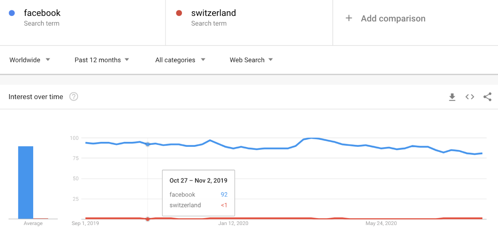
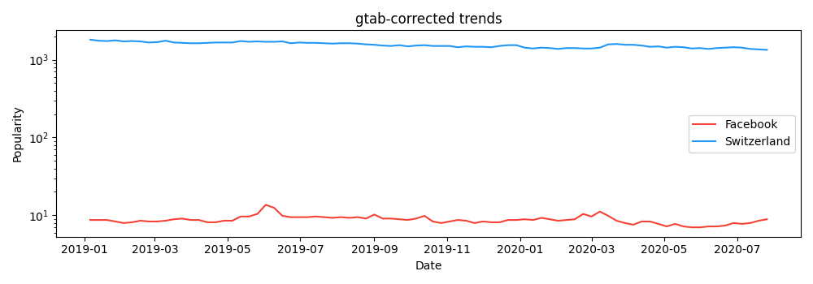
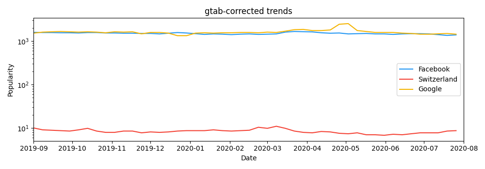

[Google Trends](https://trends.google.com/) allows users to analyze the popularity of Google search
queries across time and space.
Despite the overall value of Google Trends, data scientists face certain problems when using it:

1. Per Google Trends request, only up to 5 Google queries can be compared, and the results are relative (between 0 and 100), not absolute.
2. Results are rounded to integer precision, which may cause major problems.

Let's illustrate these two problems visually.
For example, lets say you want to compare the popularity of searches for "Facebook" to searches for "Swaziland":

We find that the comparison is highly non-informative:
Since the popularity of "Swaziland" is always "<1%", we simply can't compare the two!
Moreover, if we did another query, say, "Facebook" and "Google", the values for "Facebook" would be different, since the results are relative:

**Trivia:** The (former) Kingdowm of Swaziland changed their name to the Kingdom of Eswatini in 2018, to prevent confusions with Switzerland.
# `gtab` to the rescue!

Fortunately, this library solves these problems. Simply run this code:

~~~python
import gtab
t = gtab.GTAB()
# Make the queries which will return precise values!
query_facebook = t.new_query("facebook")
query_swaziland = t.new_query("swaziland")
~~~

And you will have the two queries in a universal scale.
Your output is a Pandas DataFrame that looks like this:

~~~
(query_swaziland)

            max_ratio  max_ratio_hi  max_ratio_lo
date                                             
2019-01-06   8.692366      9.284194      8.141688
2019-01-13   8.503401      9.084534      7.962750
2019-01-20   8.503401      9.084534      7.962750
~~~

Here, `max_ratio` is the calibrated value and `max_ratio_(hi|low)` are error bounds determined by our method.
You could plot those (we use log-scale to make things nicer) and get something like:

~~~python
import matplotlib.pyplot as plt 
plt.plot(query_swaziland.max_ratio)
plt.plot(query_facebook.max_ratio)
# lots of plotting code omitted here :)
plt.show()
~~~

In this plot, "Swaziland" is now not distorted by the huge difference in popularity anymore.
(You can even see some oscillations of popularity.)

Importantly, if we now queried "Google", as in the example above, results would appear on the same scale:

~~~python
query_google = t.new_query("Google")
plt.plot(query_swaziland.max_ratio )
plt.plot(query_facebook.max_ratio)
plt.plot(query_google.max_ratio)
# lots of stuff omitted here also! :)
plt.show()
~~~

# You can also do it from the command line!

More of a command-line person? Worry not! You can also use `gtab` with it (on UNIX-like computers at least...).
First, you have to initialize the `gtab` config directory somewhere:

~~~bash
gtab-init your-path-here
~~~

And then you can simply query anything with:

~~~bash
gtab-query Swaziland Google Facebook --results_file my_query.json 
~~~

Your query(ies) will be saved in `your-path-here/query_results/my_query.json`.
The output looks like this:

~~~json
{
    "Swaziland": {
        "ts_timestamp": [
            "2019-01-06 00:00:00",
            "2019-01-13 00:00:00",
             (...)
        ],
        "ts_max_ratio": [
            8.692365835222983,
            8.503401360544222,
            (...)
        ],
        "ts_max_ratio_hi": [
            9.284193998556656,
            9.08453391256619,
            (...)
        ],
        "ts_max_ratio_lo": [
            8.141687902460793,
            7.962749706802314,
            (...)
        ]
    },
    "Google": {(...)},
    "Facebook": {(...)}
~~~

Where `ts_timestamp` is an array with dates, and, `max_ratio` is the calibrated value and `max_ratio_(hi/low)` are error bounds related to our method.

# How does it work?

**TL;DR:
`gtab` constructs a series of pre-computed queries,
and is able to calibrate any query by cleverly inspecting those.**

More formally, the method proceeds in two phases:

1. In the *offline pre-processing phase*, an "anchor bank" is constructed, a set of Google queries spanning the full spectrum 
of popularity, all calibrated against a common reference query by carefully chaining multiple Google Trends requests.

2. In the *online deployment phase*, any given search query is calibrated by performing an efficient binary search in the anchor bank.
Each search step requires one Google Trends request (via [pytrends](https://github.com/GeneralMills/pytrends)), but few
 steps suffice (see [empirical evaluation](https://arxiv.org/abs/2007.13861)).

A full description of the `gtab` method is available in the following paper:

> Robert West. **Calibration of Google Trends Time Series.** In *Proceedings of the 29th ACM International Conference on Information and Knowledge Management (CIKM)*. 2020. [**[PDF](https://arxiv.org/abs/2007.13861)**]

Please cite this paper when using `gtab` in your own work.

Code and data for reproducing the results of the paper are available in the directory [`cikm2020_paper`](cikm2020_paper).

# Installation

The package is available on pip, so you just need to call
~~~python
python -m pip install gtab
~~~

The explicit list of requirements can be found in [`requirements.txt`](requirements.txt).
We developed and tested it in Python 3.8.1.

# Example usage

Want to use python? See [`example/example_python.ipynb`](example/example_python.ipynb).

Want to use the command line?  See [`example/example_cli.ipynb`](example/example_cli.md).

# F.A.Q.

#### **Q: Where can I understand more on the maths behind `gtab`?**

Your best bet is to read the CIKM paper. The PDF can be found [here](https://arxiv.org/abs/2007.13861).
Additionally, [this](cikm2020_paper/README.md) appendix explains how to calculate the error margins for the method

#### **Q: Do I need a new anchor bank for each different location and time I wanna query google trends with?**

Yes! But building those is easy! Be sure to check our examples, we teach how to do this [there](example/).

#### **Q: Okay, so you always build the anchor banks with the same candidates (those in `/gtab/data/anchor_candidate_list.txt`), can I change that?**

*Yes, you can!* You can provide your own candidate list (a file with one word per line). 
Place it over the `./data` folder for whatever path you created and enforce its usage with:

~~~python
import gtab
t = gtab.GTAB()
t.set_options(gtab_config = {"anchor_candidates_file": "your_file_name_here.txt"})
~~~

We then need to set N and K, as described in the [paper](https://arxiv.org/abs/2007.13861). 
Choosing N and K depends on the anchor candidate data set we are using.
 N specifies how deep to go in the data set, i.e. take the first N keywords from the file for sampling. 
 K specifies how many stratified samples we want to get. N has to be smaller than the total number of keywords in the
  anchor candidate data set, while it is good practice to set K to be in the range [0.1N, 0.2N]. 
  For example, if we want to set N=3000 and K=500, we call:
  
~~~python
t.set_options(gtab_config = {"num_anchor_candidates": 3000, "num_anchors": 500})
~~~

You can also edit these parameters in the config files:
1. `config/config_py.json` if you are using the Python api
2. `config/config_cl.json` if you are using the CLI.

Confused? Don't worry! The default candidate list works pretty well!
