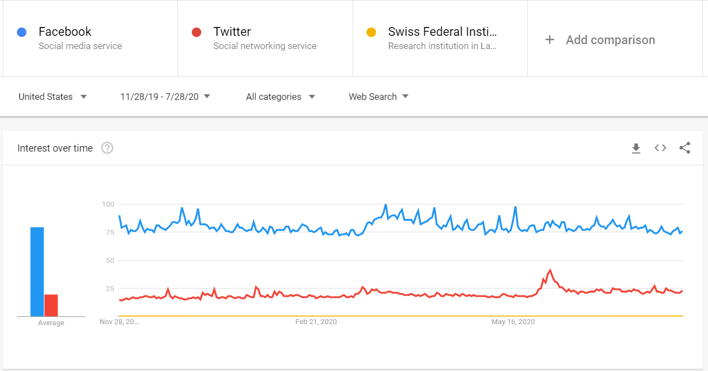

# `gtab` example usage
When querying Google Trends, it outputs scores as integers in the range [0, 100].
For example, when we query Facebook (/m/02y1vz), Twitter (/m/0289n8t), and EPFL (/m/0jg7r, a swiss university) we get the following:

We have two problems here:

1. EPFL is always listed as <1\%, so it does not convey any information to us!

2. GTrends limits us to 5 keywords! Would not work if we wanted to compare dozens or hundreds of keywords?

To solve both of these issues we can use the `gtab`! 

## 1: Setting it up!

We need to create and initialize a directory with `gtab`'s config. Running:

~~~bash
gtab-init example_path_bash
~~~

Will create a directory `example_path_bash` with pre-made settings!

There are two default anchorbanks included in the package. 
To list them use:

~~~bash
gtab-list
> ...
> Existing GTABs:
>  google_anchorbank_geo=IT_timeframe=2019-01-01 2020-08-01.tsv
>  google_anchorbank_geo=_timeframe=2019-01-01 2020-08-01.tsv
~~~

`google_anchorbank_geo=_` is the global anchor bank. 

In this example we will continue to use it, but you could change to another anchorbank, for example the Italian one by using:

~~~bash
gtab-set-active "google_anchorbank_geo=IT_timeframe=2019-01-01 2020-08-01.tsv"
~~~

This reverts to the global anchor bank:

~~~bash
gtab-set-active google_anchorbank_geo=IT_timeframe=2019-01-01\ 2020-08-01.tsv
~~~

## 2: Making a query! 
Now we can request a new query and calibrate it using our selected anchor bank! 

The `new_query` method will output a json containing the dates (`ts_timestamp`), 
estimated value (`max_ratio`), and error intervals (`max_ratio_hi` and `max_ratio_lo`)

~~~bash
 gtab-query /m/0jg7r --results_file my_query.json # EPFL Freebase ID
~~~

~~~json
{
    "/m/0jg7r": {
        "ts_timestamp": [
            "2019-01-06 00:00:00",
            "2019-01-13 00:00:00",
            (...)
        ],
        "ts_max_ratio": [
            0.31,
            0.37,
            (...)
        ],
        "ts_max_ratio_hi": [
            0.3216315789473684,
            0.38289473684210523,
            (...)
        ],
        "ts_max_ratio_lo": [
            0.29871134020618556,
            0.35747422680412366,
            (...)
        ]
    }
}
~~~

## 3: Creating your own anchor bank

For example, if we want to construct an anchorbank with data from Germany between March 5th 2020 and May 5th 2020, we set:

~~~bash
gtab-set-options --geo "DE" --timeframe "2020-03-05 2020-05-05"
~~~

And then run the construction! Which can take a while!

~~~bash
gtab-create
~~~

Now we have another available anchor bank:

~~~bash
gtab-list
> (...)
> Existing GTABs:
>        google_anchorbank_geo=IT_timeframe=2019-01-01 2020-08-01.tsv
>        google_anchorbank_geo=DE_timeframe=2020-03-05 2020-05-05.tsv
>        google_anchorbank_geo=_timeframe=2019-01-01 2020-08-01.tsv

~~~

We can set it as default and make new queries, now in this new location/timeframe!

~~~bash
gtab-set-active "google_anchorbank_geo=DE_timeframe=2020-03-05 2020-05-05.tsv"
gtab-query /m/0jg7r --results_file my_query.json # EPFL Freebase ID
~~~

And this will output a new `my_query.json` now with the query done in this time frame (2020-03-05 to 2020-05-05) and in this location (Germany)!